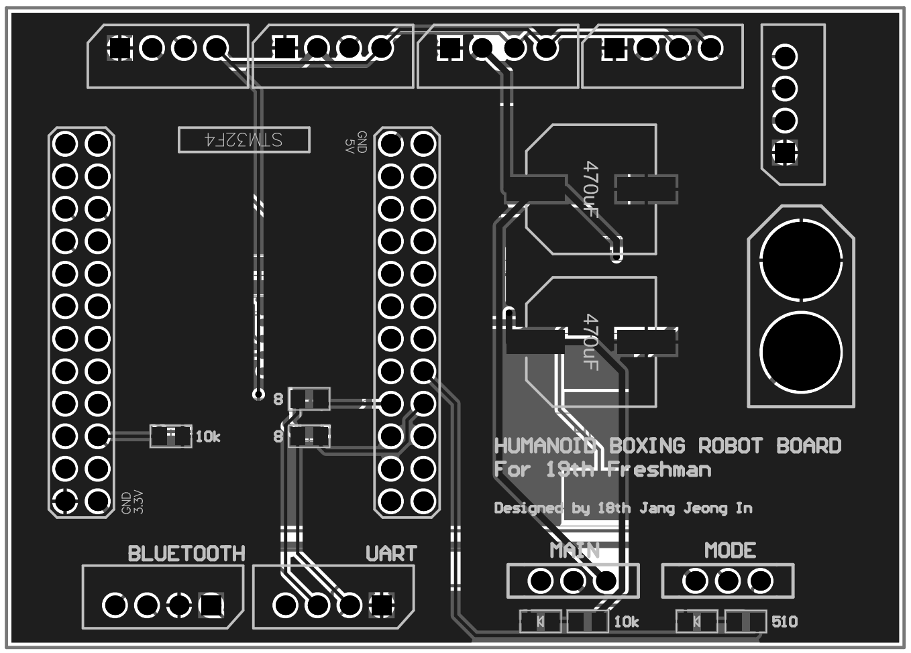
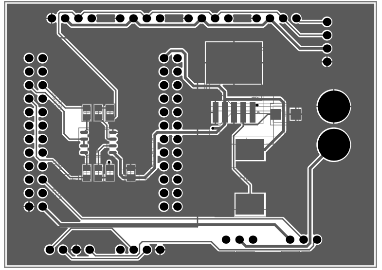

<html lang="en">
  <head>
    <meta charset="uft-8">
    <meta name="author" content="Jeongin Jang">
  </head>
  <body>
    <h1>Boxing Robot Board</h1>
    <h2>About BoxingRobot Board</h2>
    

       The Boxing Robot board is a project of the 19th freshman of the RO:BIT Humanoid Team, and is a single board for driving a robot designed to be mounted on the designed robot.
       
       
      <!--
      -->
      <table>
        <tr>
          <td>
            <a href="iamge/BoxingRobot_Front.png">
              

                
              

            </a>
          </td>
          <td>
            <a href="iamge/BoxingRobot_Back.png">
              

                
              

            </a>
          </td>
          <td>
            <a href="image/SRCIRC24_MainBoard.png">
              

                
            

          </td>
          <td>
            <a href="image/SRCIRC24_MainBoard.png">
              

                
            

          </td>
        </tr>
        <tr>
          <td>
            

              PCB preview image(Front)
            

          </td>
          <td>
            

              PCB preview image(Back)
            

          </td>
          <td>
            

              After mounting electronic components
            

          </td>
          <td>
            

              After attaching module board
            

          </td>     
        </tr>
      </table>
    

    <h2>Repository Contents</h2>
    

    <dl>
      <dt>\image</dt>
      <dd>PCB preview images and capture of design screen</dd>
      <dt>\libraries</dt>
      <dd>Libraries used in Altium designer</dd>
      <dt>\Schematic</dt>
      <dd>Circuit diagram of this product</dd>
      <dt>.sch</dt>
      <dd>Schematic design file by Altium</dd>
    </dl>
    

    <h2>Documentation</h2>
      

        <h3>Materials</h3>
        The below shows the components actually mounted on the CHULSU-OP4 equipped MainBoard in Boxing Robot. Their details are listed below.
       
       
          <table>
            <thead>
              <tr>
                <th> Design Parts </th>
                <th> Quantity </th>
                <th> Comment </th>
                <th> Supplier </th>
                <th> Description </th>
              </tr>
            </thead>
            <tbody>
              <tr>
                <td>R1, R2, R3, R4, R5, R6, R7, R8, R9, R10, R11</td>
                <td>11</td>
                <td>SMD type Resistor</td>
                <td><a href="https://www.devicemart.co.kr/goods/view?no=6061">Devicemart</a></td>
                <td>ChipResistor SMD F (±1%) 1KΩ 1608</td>
              </tr>
              <tr>
                <td>C1,C2</td>
                <td>2</td>
                <td>Electrolytic Capacitor</td>
                <td><a href="https://www.eleparts.co.kr/goods/view?no=14714341">Devicemart</a></td>
                <td>electrolytic capacitor CAP 470UF 25V SMD</td>
              </tr>
              <tr>
                <td>C3</td>
                <td>1</td>
                <td>SMD type ceramic capacitor</td>
                <td><a href="https://www.devicemart.co.kr/goods/view?no=12031936">Eleparts</a></td>
                <td> CAPACITOR CERAMIC, 0.1UF, 50V, X7R, 10%</td>
              </tr>
              <tr>
                <td>D1</td>
                <td>1</td>
                <td>[SM340A]Schottky Barrier Diode</td>
                <td><a href="https://www.eleparts.co.kr/goods/view?no=9536722">Eleparts</a></td>
                <td>Schottky Diodes 40V Independent Type 500mV@3A 3A DO-214AC(SMA) Schottky Diodes ROHS / LCSC</td>
              </tr>
              <tr>
                <td>D2,D3</td>
                <td>2</td>
                <td>LED</td>
                <td><a href="https://www.devicemart.co.kr/goods/view?no=14047555">Devicemart</a></td>
                <td>Chip LED 2V 25mA 65mW 120mcd red 1608</td>
              </tr>
              <tr>
                <td>J1, J2, J3, J4, J5, J6, J7, J8</td>
                <td>7</td>
                <td>Molex 4Pin Connector</td>
                <td><a href="https://www.devicemart.co.kr/goods/view?no=419">Devicemart</a></td>
                <td>Connector 4pin 2.5mm Pitch</td>
              </tr>
              <tr>
                <td>J3</td>
                <td>1</td>
                <td>XT60_M</td>
                <td><a href="https://www.eleparts.co.kr/goods/view?no=13428798">Eleparts</a></td>
                <td>XT_60 Connector MALE</td>
              </tr>
              <tr>
                <td>L1</td>
                <td>1</td>
                <td>SMD type Inductor</td>
                <td><a href="https://www.devicemart.co.kr/goods/view?no=6615">Devicemart</a></td>
                <td>Power Inductor 33uH 12.2 X 12.2 X 8.0 -20℃ ~85℃</td>
              </tr>
              <tr>
                <td>S1,S2</td>
                <td>2</td>
                <td>slide switch</td>
                <td><a href="https://www.devicemart.co.kr/goods/view?no=38883">Devicemart</a></td>
                <td>Slide Switch Knob height: 4mm horizontal slide switch 3PIN 1C2T DC 50V 0.5A</td>
              </tr>
              <tr>
                <td>U1</td>
                <td>1</td>
                <td>LM2596</td>
                <td><a href="https://www.devicemart.co.kr/goods/view?no=10037">Devicemart</a></td>
                <td>Simple 5V Transformer</td>
              </tr>
              <tr>
                <td>U2</td>
                <td>1</td>
                <td>STM32F405RGT6</td>
                <td><a href="https://www.devicemart.co.kr/goods/view?no=15227518">Devicemart</a></td>
                <td>1MB 1.8V~3.6V ARM-M4 192KB 168MHz FLASH 51 LQFP-64(10x10) Microcontrollers (MCU/MPU/SOC) ROHS / LCSC</td>
              </tr>
              <tr>
                <td>U3</td>
                <td>1</td>
                <td>MAX485</td>
                <td><a href="https://www.devicemart.co.kr/goods/view?no=1058447">Devicemart</a></a></td>
                <td>convertor 232to485</td>
              </tr>
            </tbody>
